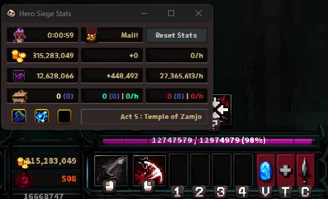

<div align="center">

# ⚔️ Hero Siege Stats

**Расширенный трекер статистики для Hero Siege**  
**Advanced statistics tracker for Hero Siege**

[](https://github.com/poeopt/HeroStats/releases)
[](https://github.com/poeopt/HeroStats/releases)
[](https://github.com/poeopt/HeroStats/releases)
[](https://discord.gg/SjkJM6nv)

---

*[🇷🇺 Русский](#-русский) | [🇬🇧 English](#-english)*

</div>

---

## 🇷🇺 Русский

### О программе

**Hero Siege Stats** — это оверлей-программа для Hero Siege, которая перехватывает трафик между игровым клиентом и сервером и в реальном времени отображает статистику фарма прямо поверх игры.

Программа построена на базе открытого проекта [GuilhermeFaga/hero-siege-stats](https://github.com/GuilhermeFaga/hero-siege-stats) и существенно расширена новым функционалом.

### 🖼️ Превью



### ✨ Функции

#### Главное окно
| Функция | Описание |
|---|---|
| ⏱ Таймер сессии | Время с момента старта или сброса |
| 🪙 Золото | Текущее · Заработано за сессию · В час |
| ⭐ Опыт | Всего · За сессию · В час |
| 📦 Дропы | Ангелические · Героические · Сатанинские с MF счётчиком |
| 🔮 Сатаническая зона | Название зоны + 3 активных баффа с иконками и описанием (RU/EN) |
| 🗼 Башня Хаоса | Этажей за всё время · За сессию · Боссов убито |
| 🌀 Вормхол | Прогресс по актам A1–A8 |
| ☠ Счётчик смертей | Показывается рядом с таймером |
| ✉ Уведомление о почте | Мигающий индикатор + звук при получении |

#### Лог дропов (отдельное окно)
- Последние 50 предметов: время · редкость · тир · качество · сокеты · MF
- Статистика: всего / Сат / Анг / Гер / MF
- Кнопка очистки

#### Эффективность зон (отдельное окно)
- Золото/ч · Опыт/ч · Сат/ч · Анг/ч по каждой Satanic Zone
- % сравнение с лучшей зоной (🔴 ≥90% · 🟡 ≥60% · ⬜ ниже)
- Рейтинг зон по составному скору
- Заметки о стратегии фарма к каждой зоне
- Сортировка: ⭐ Рейтинг / G/ч / XP/ч / Сат/ч / Время

#### Уведомления и звук
- Toast-оверлей при дропе Satanic / Angelic / Heroic
- Звук при дропе (генерируется автоматически)
- Кастомные WAV файлы до 5 секунд: `assets/sounds/custom_satanic.wav`

#### Настройки
- Язык: 🇷🇺 Русский / 🇬🇧 English (мгновенное переключение)
- Вкл/выкл уведомлений по редкости
- Вкл/выкл звука
- Автосохранение сессий в JSON
- История последних 10 сессий

### ⚠️ Ограничения

- Золото из почтового ящика считается как заработанное
- Опыт может отображаться неточно при повышении уровня
- Предметы перемещённые между инвентарями засчитываются как подобранные
- Предметы выброшенные другими игроками засчитываются как подобранные
- Информация об аукционе недоступна (не передаётся в трафике)

### ✅ Разрешено ли использование?

Программа читает **только пассивный трафик** между клиентом и сервером — не изменяет игру, не инжектит код, не даёт игрового преимущества. Разработчик оригинала получил подтверждение от команды Hero Siege что подобный инструмент допустим.

### 📦 Установка и запуск

**Быстрый старт (EXE):**
1. Установи [Npcap](https://npcap.com/dist/npcap-1.77.exe) — нужен для перехвата трафика
2. Скачай `HeroSiegeStats.exe` со [страницы релизов](https://github.com/poeopt/HeroStats/releases)
3. Запусти от имени администратора
4. Запусти Hero Siege и начни играть

**Из исходников:**
```bash
# Требования: Python 3.11, Poetry
git clone https://github.com/poeopt/HeroStats.git
cd HeroStats/HSFinal
poetry install --no-root
poetry run python hero-siege-stats.py
```

**Сборка EXE:**
```bash
poetry run python build.py
# Результат: dist/HeroSiegeStats.exe
```

### 🔔 Кастомные звуки

Положи WAV файлы (максимум 5 секунд) в папку `assets/sounds/`:
- `custom_satanic.wav` — при Satanic дропе
- `custom_angelic.wav` — при Angelic/Unholy дропе  
- `custom_heroic.wav` — при Heroic дропе
- `custom_mail.wav` — при получении почты

---

## 🇬🇧 English

### About

**Hero Siege Stats** is an overlay application for Hero Siege that passively intercepts network traffic between the game client and server, displaying real-time farming statistics over the game window.

Built on top of the open-source project [GuilhermeFaga/hero-siege-stats](https://github.com/GuilhermeFaga/hero-siege-stats) with significant new features added.

### ✨ Features

#### Main window
| Feature | Description |
|---|---|
| ⏱ Session Timer | Time since start or last reset |
| 🪙 Gold | Current · Earned this session · Per hour |
| ⭐ Experience | Total · Earned · Per hour |
| 📦 Item Drops | Angelic · Heroic · Satanic with MF counter |
| 🔮 Satanic Zone | Zone name + 3 active buffs with icons and descriptions (RU/EN) |
| 🗼 Chaos Tower | Total cleared · This session · Boss kills |
| 🌀 Wormhole | Progress per act A1–A8 |
| ☠ Death Counter | Shown next to the session timer |
| ✉ Mail Notification | Blinking indicator + sound on new mail |

#### Drop Log (separate window)
- Last 50 item drops: time · rarity · tier · quality · sockets · MF flag
- Summary bar: total / Sat / Ang / Her / MF counts
- Clear button

#### Zone Efficiency (separate window)
- Gold/h · XP/h · Sat/h · Ang/h per Satanic Zone
- % comparison vs best zone (🔴 ≥90% · 🟡 ≥60% · ⬜ below)
- Composite score ranking
- Strategy notes field per zone
- Sort by: ⭐ Score / G/h / XP/h / Sat/h / Time

#### Notifications & Sound
- Toast overlay on Satanic / Angelic / Heroic drops
- Auto-generated beep sounds (no files needed)
- Custom WAV files up to 5 seconds: `assets/sounds/custom_satanic.wav`

#### Settings
- Language: 🇷🇺 Russian / 🇬🇧 English (instant switch, no restart)
- Toggle notifications per rarity
- Toggle sound
- Auto-save sessions to JSON
- Last 10 sessions history

### ⚠️ Known Limitations

- Gold picked up from the mailbox is counted as earned gold
- XP earned may be inaccurate when leveling up
- Items moved between inventories are counted as picked up
- Items dropped by other players are counted as picked up
- Auction data is not available (not transmitted in captured traffic)

### ✅ Is this allowed?

This tool only **reads passive network traffic** between client and server — it does not modify the game, inject code, or provide gameplay advantage. The original developer received confirmation from the Hero Siege team that this type of tool is permitted.

### 📦 Installation

**Quick start (EXE):**
1. Install [Npcap](https://npcap.com/dist/npcap-1.77.exe) — required for traffic capture
2. Download `HeroSiegeStats.exe` from the [releases page](https://github.com/poeopt/HeroStats/releases)
3. Run as Administrator
4. Launch Hero Siege and start playing

**Run from source:**
```bash
# Requirements: Python 3.11, Poetry
git clone https://github.com/poeopt/HeroStats.git
cd HeroStats/HSFinal
poetry install --no-root
poetry run python hero-siege-stats.py
```

**Build EXE:**
```bash
poetry run python build.py
# Output: dist/HeroSiegeStats.exe
```

### 🔔 Custom Sounds

Place WAV files (max 5 seconds) into `assets/sounds/`:
- `custom_satanic.wav` — on Satanic drop
- `custom_angelic.wav` — on Angelic/Unholy drop
- `custom_heroic.wav` — on Heroic drop
- `custom_mail.wav` — on new mail

---

<div align="center">

## 🛠️ Tech Stack


## 🙏 Credits

Based on [hero-siege-stats](https://github.com/GuilhermeFaga/hero-siege-stats) by [Guilherme Faga](https://faga.dev)  
Thanks to **Shalwkz** for server address research  
Inspired by [Albion Online Stats](https://github.com/mazurwiktor/albion-online-stats)

## 💬 Community

[](https://discord.gg/SjkJM6nv)

</div>
